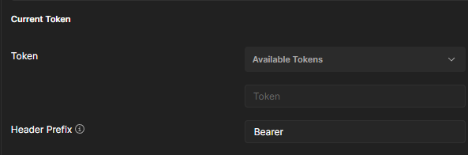

# Products Manager

## Table of Contents

- [Project Description](#project-description)
- [Features / Modules](#features--modules)
- [Prerequisites](#prerequisites)
- [Dependencies/Technology](#dependenciestechnology)
- [Getting Started](#getting-started)
- [API Documentation](#api-documentation)
- [Security](#security)
- [Postman Screenshots](#postman-screenshots)
- [Database Schema](#database-schema)
- [Configuration](#configuration)
- [Contributing](#contributing)

## Project Description

Products Manager is a microservices-based application designed to handle various aspects of product management,
inventory tracking, order processing, and user services. It employs Spring Boot and related technologies to provide a
scalable and flexible solution for managing a range of e-commerce operations.

## Features / Modules

1. **Product Service:**

- Allows CRUD operations for managing product information.
- Retrieves product details, including name, description, price, and availability.
- Supports the creation, modification, and deletion of products.

2. **Inventory Service:**

- Handles inventory tracking and stock management.
- Tracks the quantity of products available in the inventory.
- Updates the inventory upon successful order placement and fulfillment.

3. **Order Service:**

- Manages order processing, tracking, and fulfillment.
- Facilitates order placement by customers.

4. **User Service:**

- Manages user registration, authentication, and authorization.

5. **Discovery Service:**

- Provides service discovery and registration using Spring Cloud Netflix Eureka Server.
- Allows microservices to register and discover other services within the architecture.
- Facilitates communication between different services by providing a centralized registry.

6. **API Gateway:**

- Serves as the entry point to the microservice's architecture.
- Handles routing and load balancing using Spring Cloud Gateway.
- Acts as a single access point for all client requests, reducing complexity 
and improving scalability.

7. **OAuth2 Server:**

- Implements an OAuth2 authorization server for securing API endpoints.
- Manages authentication and authorization processes.
- Generates JWT and validates user permissions.

8. **Notification Service:**

- Handles notifications and alerts related to orders and inventory.
- ends alerts to administrators or relevant stakeholders for low stock levels or critical events.

## Prerequisites

Before running this application, make sure you have the following installed:

- Java 17
- Maven
- Docker

## Dependencies/Technology

This project has the following dependencies:

- **Spring Boot Starter Data JPA**
- **MySQL Connector**
- **Spring Boot Starter Data MongoDB**
- **Spring Boot Starter Web**
- **Spring Boot Starter Webflux**
- **Spring Boot Starter Validation**
- **Lombok/MapStruct**
- **Spring Boot Starter Security**
- **Spring OAuth2 Resource Server/Authorization Server**
- **Spring Cloud Starter Netflix Eureka Server/Client**
- **Spring Cloud Starter Gateway**
- **Spring Kafka**
- **Springdoc OpenAPI**

## Getting Started

To set up the project locally, follow these steps:

1. Clone the repository: 

`git clone https://github.com/YunYunoy/ProductsManager-microservices`

2. Navigate to the project directory:

`cd ProductsManager-microservices`

3. Build the project:

`mvn clean install`

4. Set up the database and message-broker:

- run docker-compose.yml

`docker-compose up -d`

- see databases under url:

[http://localhost:8081](http://localhost:8081/)

[http://localhost:8090](http://localhost:8090)

5. Start each microservice individually by navigating into each module and running `mvn spring-boot:run`. Start them in
any order starting from Discovery_Service:

## API Documentation

The application provides API endpoints for interacting with different services. For detailed API documentation, access
the following URL after running the application:

- API Gateway: [http://localhost:8080/swagger-ui.html](http://localhost:8080/swagger-ui.html)
- Product Service: [product-service/swagger-ui/index.html](http://localhost:8082/product-service/swagger-ui/index.html)
- Order Service [order-service/swagger-ui/index.html](http://localhost:8085/order-service/swagger-ui/index.html)
- Inventory Service [inventory-service/swagger-ui/index.html](http://localhost:8083/inventory-service/swagger-ui/index.html)
- User Service [user-service/swagger-ui/index.html](http://localhost:8084/user-service/swagger-ui/index.html)

### OpenApi Screenshots

## Security
The security process follows the OAuth 2.0 protocol, which provides a secure and standardized way 
for accessing protected resources on behalf of users. The authentication server is responsible for granting 
access tokens to authorized client applications. 
- For full application access please run OAuth2Server `mvn spring-boot:run` and generate/use token:

## Postman screenshots

###### product-controller.GET

###### product-controller.PUT

###### product-controller.POST (not-validated-response)

###### inventory-controller.PUT

###### inventory-controller.GET

###### inventory-controller.POST (not-validated-response)

###### order-controller.GET

###### order-controller.POST (not-validated-response)

###### order-controller.PUT 

###### order-controller.DELETE (not-validated-response)

## Database Schema

## Configuration

The project's configuration is managed through the parent `pom.xml` and `application.properties` files within each
microservice module. Customize these files according to your specific requirements.

## Contributing

Contributions to the Products Manager project are welcome.
If you encounter any issues or have suggestions for improvements,
please [create an issue](https://github.com/YunYunoy/ProductsManager-microservices/issues) or submit a pull request.
